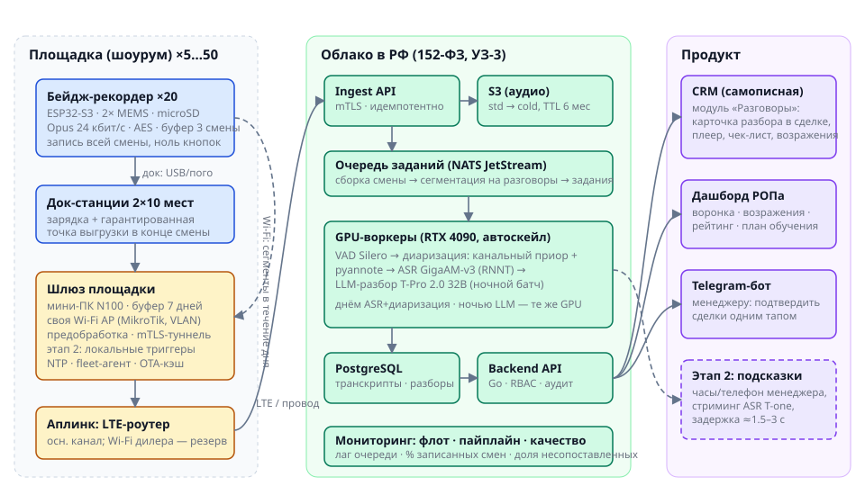
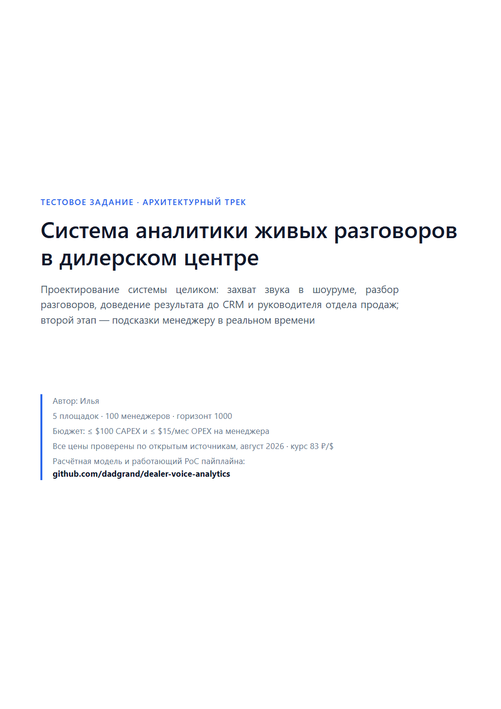
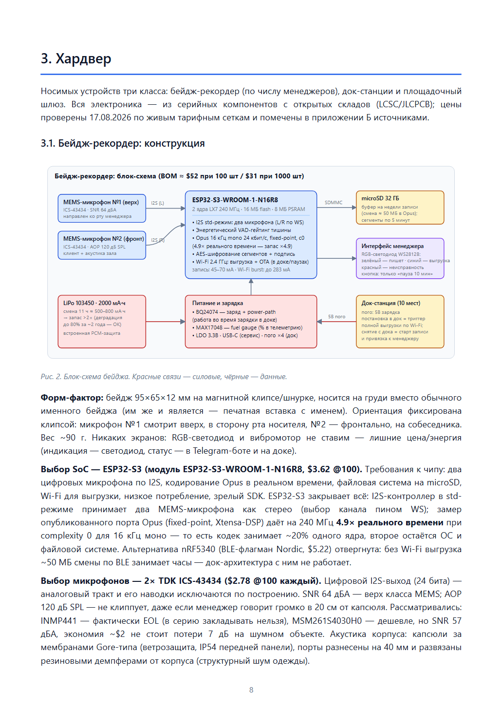
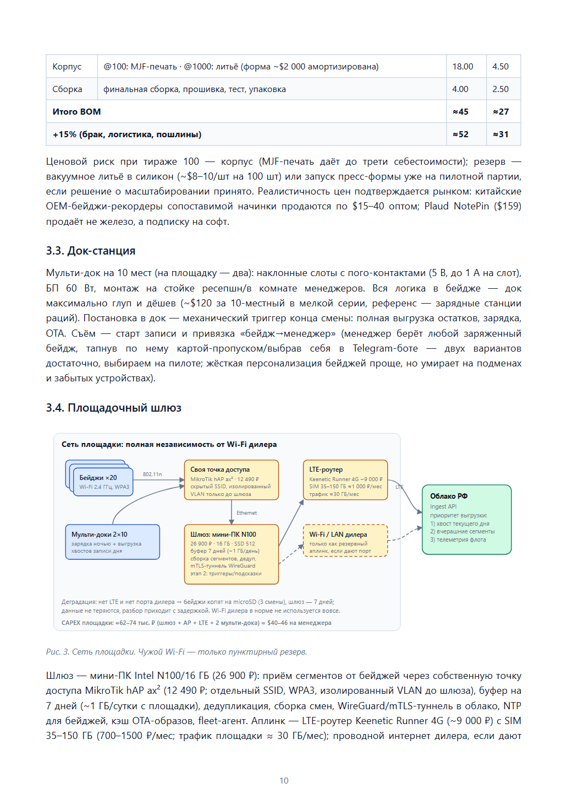
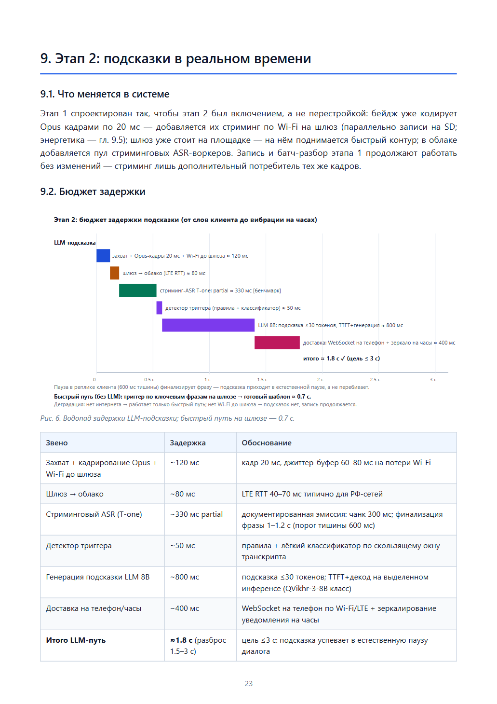

<div align="center">

# 🎙️ Система аналитики живых разговоров в дилерском центре

**Тестовое задание, архитектурный трек** — спроектировать целиком систему, которая записывает
разговоры менеджеров с клиентами в шумном шоуруме, превращает их в структурированный разбор
и доводит до CRM, а вторым этапом подсказывает менеджеру в реальном времени.

[](Тестовое_задание_система_аналитики_разговоров.pdf)
[](poc/)
[](research/)

[](calc/model.py)
[-7c3aed)](https://github.com/salute-developers/GigaAM)
[](https://github.com/snakers4/silero-vad)
[](README.md#-юридическая-рамка-в-двух-словах)

**[Читать документ (PDF)](Тестовое_задание_система_аналитики_разговоров.pdf)** ·
[Расчётная модель](calc/model.py) ·
[Запустить PoC](#-poc-пайплайн-в-миниатюре-за-две-команды) ·
[Диаграммы](diagrams/)

</div>

---

## 💡 Решение на одной картинке



Каждый менеджер носит **бейдж-рекордер собственной разработки** (ESP32-S3, два MEMS-микрофона,
Opus на борту, BOM ≈ $52 @100 шт): снял с док-станции — запись пошла, поставил — выгрузилось
и заряжается, **ноль кнопок**. Близкий микрофон побеждает шум физикой (+20–26 дБ к прямому
сигналу против потолочных массивов), а асимметрия каналов даёт **разделение ролей
«менеджер/клиент» без голосовой идентификации** — система остаётся вне режима биометрии.
Площадка автономна: свой шлюз, своя Wi-Fi-точка, LTE-аплинк — от Wi-Fi дилера не зависит
ничего. Облако — российское (152-ФЗ): GigaAM-v3 → pyannote → T-Pro 2.0 → карточка разбора
в самописной CRM и дашборд РОПа.

## 📊 Ключевые цифры

Консервативный сценарий, все цены — август 2026, курс 83 ₽/$:

| | 100 менеджеров | 1000 менеджеров | бюджет |
|---|---:|---:|---|
| **CAPEX** на менеджера (бейдж + ЗИП + док + доля шлюза) | **$98** | **$75** | ≤ $100 |
| **OPEX** на менеджера в месяц | **$11.7** | **$8.9** | ≤ $15 |
| Задержка подсказки этапа 2 (до вибрации на часах) | **≈ 1.8 с** | ≈ 1.8 с | ≤ 3 с |
| Пиковый час | 60 разговоров | 600 разговоров | разбор ≤ 2 ч |

Экономику держат три решения: self-hosted ASR вместо облачных API (SpeechKit/SaluteSpeech
стоили бы **$28/мес на менеджера** — вдвое больше всего бюджета), аренда GPU класса RTX 4090
в РФ от 40–83 ₽/час с оптимизацией «выделенные + почасовой burst», и LLM-разбор ночным батчем
на тех же GPU. Каждая цифра воспроизводится одной командой:

```bash
python calc/model.py
```

## 🚀 PoC: пайплайн в миниатюре, за две команды

Работающая демонстрация главной инженерной идеи — на CPU, без API-ключей:

```bash
pip install -r poc/requirements.txt
python poc/pipeline.py poc/demo.wav
```

`demo.wav` — синтетический диалог в двух каналах «бейджа» (менеджер +6 дБ в своём канале,
клиент −6 дБ). Пайплайн: **Silero VAD → роли по асимметрии каналов → ASR GigaAM →
JSON-разбор** по той же схеме, что в проде (приложение В документа).

<details>
<summary><b>Показать реальный вывод пайплайна</b> (роли — без единой ошибки)</summary>

```text
  [  29.7–  30.7] КЛИЕНТ   дорого
  [  31.8–  36.6] КЛИЕНТ   в салоне на волгоградке такое же дешевле предлагали
  [  38.2–  38.8] МЕНЕДЖЕР понимаю
  [  39.6–  41.6] МЕНЕДЖЕР давайте посчитаем стрейпином
  [  41.9–  43.7] МЕНЕДЖЕР вы сейчас на чем ездите
  [  45.1–  47.7] КЛИЕНТ   каралла двенадцатого года
  [  54.7–  55.9] МЕНЕДЖЕР запишу вас на тест
  [  56.0–  57.8] МЕНЕДЖЕР драйв в субботу на одиннадцать
  [  59.1–  60.5] КЛИЕНТ   я подумаю
  [  62.1–  65.3] МЕНЕДЖЕР тогда завтра пришлю расчет по кредиту и троеквину
  [  69.0–  76.7] КЛИЕНТ   восемь девятьсот шестнадцать сто двадцать три ...
```

```jsonc
{
  "outcome": "thinking",
  "objections": [
    { "type": "price",      "quote_t0": 29.7, "text": "дорого", "handled": true },
    { "type": "competitor", "quote_t0": 31.8, "text": "в салоне на волгоградке ...", "handled": true },
    { "type": "timing",     "quote_t0": 59.1, "text": "я подумаю", "handled": true }
  ],
  "checklist": [
    { "item": "уведомил о записи разговора", "done": true },
    { "item": "выяснил текущий автомобиль (трейд-ин)", "done": true },
    { "item": "предложил тест-драйв", "done": true },
    { "item": "взял контакт", "done": true },
    { "item": "зафиксировал следующий шаг", "done": true }
  ],
  "entities_for_matching": { "trade_in_model": "Toyota Corolla", "phone_mentioned": true }
}
```

</details>

Подробности, ограничения PoC и вариант с реальным LLM (GigaChat) — в [poc/README.md](poc/README.md).

## 📄 Документ

<table>
  <tr>
    <td width="25%"></td>
    <td width="25%"></td>
    <td width="25%"></td>
    <td width="25%"></td>
  </tr>
  <tr align="center">
    <td>титул</td>
    <td>гл. 3 — бейдж до партномеров</td>
    <td>гл. 3 — автономная площадка</td>
    <td>гл. 9 — задержка подсказки</td>
  </tr>
</table>

12 глав + приложения: постановка и модель нагрузки → шесть ключевых решений с отвергнутыми
альтернативами → **хардвер до уровня партномеров** (BOM @100/@1000, энергобюджет смены,
прошивка, док, шлюз) → аудиотракт и диаризация → облако и стек → пайплайн «микрофон → CRM» →
свой CRM-модуль → расчёты с чувствительностью → этап 2 → надёжность/безопасность/право →
внедрение и анти-саботаж → ROI.

## ⚖️ Юридическая рамка в двух словах

Запись разговора — персональные данные, но **не биометрия**, пока голос не используется для
установления личности (ст. 11 152-ФЗ). Поэтому в системе архитектурный запрет voice-ID: роли
даёт геометрия микрофонов. Весь конвейер — в РФ (ч. 5 ст. 18), основание обработки — таблички +
явное согласие отдельным документом + п. 5 ч. 1 ст. 6; сотрудники — через ЛНА. Полный разбор
с чек-листом внедрения и штрафами 2025–2026 — глава 10 документа.

## 🗂 Структура репозитория

```text
├── Тестовое_задание_система_аналитики_разговоров.pdf   ← основной артефакт
├── calc/model.py       # юнит-экономика: все цифры документа одной командой
├── poc/                # работающий пайплайн: WAV → VAD → роли → ASR → JSON
├── diagrams/           # 6 SVG-диаграмм (единый стиль, используются и в PDF)
├── doc/                # исходники PDF: главы (HTML) + paged.js + печать через CDP
├── research/           # конспекты веб-исследования цен/бенчмарков: URL + даты
└── assets/             # превью страниц для README
```

<details>
<summary><b>Как собирается PDF</b></summary>

```bash
python doc/build.py       # главы + инлайн SVG + оглавление -> out/document.html
python doc/print_pdf.py   # headless Chrome через DevTools Protocol -> out/document.pdf
```

Пагинация — paged.js (настоящие номера страниц в оглавлении, колонтитулы); печать — по
событию завершения вёрстки через CDP, поэтому сборка детерминирована.

</details>

## 🧭 Дисклеймер

Цены и бенчмарки собраны по открытым источникам в августе 2026 и зафиксированы в
[research/](research/) с URL и датами. ИИ использовался как инструмент разработки и
исследования; решения, расчёты и аргументация — авторские, модель и PoC воспроизводимы.

<div align="center">
<sub>Автор: <b>Илья</b> · август 2026</sub>
</div>
